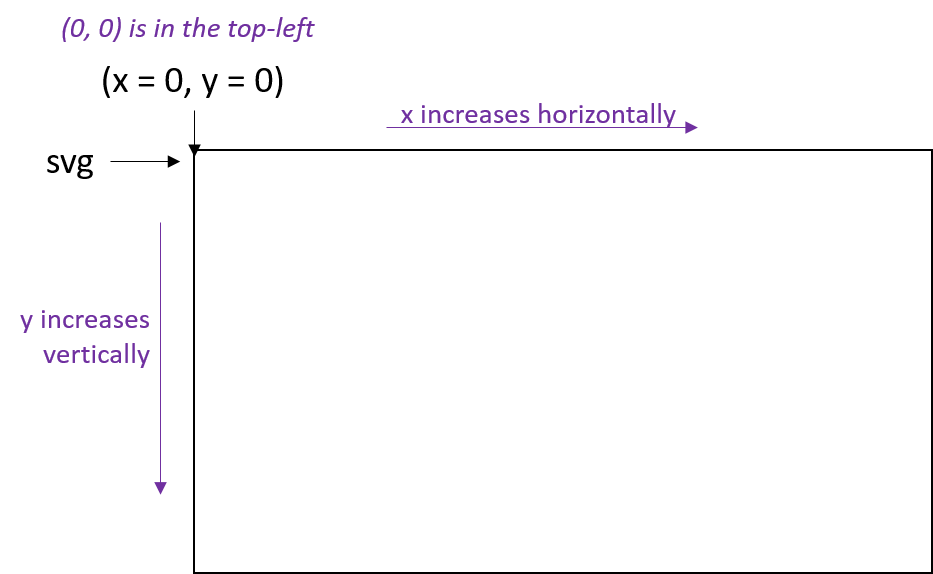
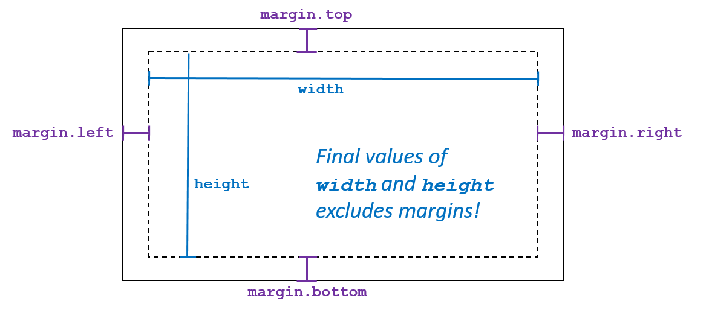
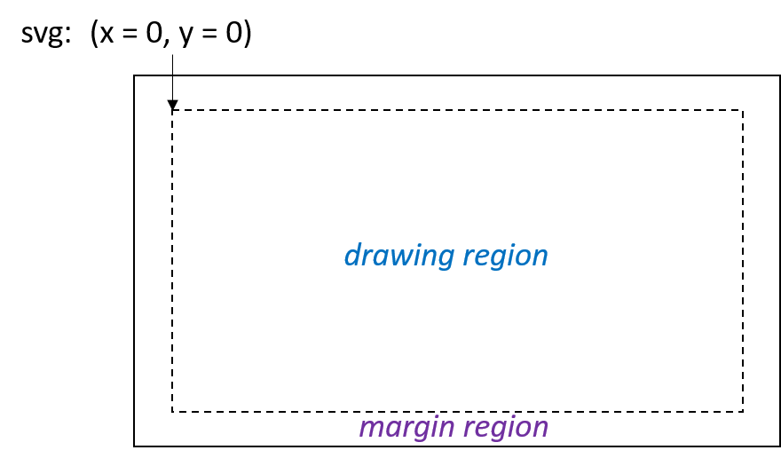

In Computer Science, boilerplate code is *sections of code that have to be
included in many places with little or no alteration* [[Wikipedia](https://en.wikipedia.org/wiki/Boilerplate_code)].
When using d3.js, the basic setup of the drawing area where you will draw
the visualization is boilerplate code in d3.js.  This section will help you
understand its purpose and when modifications to the boilerplate code should
be made.

## Understanding d3.js boilerplate code

### The coordinate system in d3.js

In nearly every application of computer graphics (as is the case in d3.js), the
top-left corner of is defined to be the origin or **(x = 0, y = 0)**.  From the origin
`x` increases horizontally and `y` increases vertically.

*Note that the y-axis differs from the Cartesian coordinate system used in mathematics,
where the y-axis in Computer Science increases move down from the origin at the top-left.*

### margin, width, and height variables

The first three lines of the boilerplate code for d3.js involves defining the size
of the visualization:

<pre class="prettyprint">
var margin = { top: 50, right: 50, bottom: 50, left: 50 },
    width = 970 - margin.left - margin.right,
    height = 700 - margin.top - margin.bottom;
</pre>

The values of each of these variables are in values, in pixels, for the global
layout elements of the visualization.
- The `margin` values are contained in a JavaScript dictionary/object; you can
  access their values with the code `margin.left`, `margin.right`, etc.

The default values given in the boilerplate code creates a **drawing area** that
can be viewed, in full, on any desktop/laptop computer without scrolling either
vertically or horizontally.  These values may need to be adjusted for certain
visualizations and would need to be adapted for mobile-friendly visualizations.

Visually, the following diagram illustrates the visualization with the margins,
width, and height:

### Creating the SVG canvas

The last eight lines of the boilerplate code creates the canvas that will be used
to draw the visualization:

<pre class="prettyprint">
var svg = d3.select("#chart")
            .append("svg")
            .attr("width", width + margin.left + margin.right)
            .attr("height", height + margin.top + margin.bottom)
            .style("width", width + margin.left + margin.right)
            .style("height", height + margin.top + margin.bottom)
            .append("g")
            .attr("transform", "translate(" + margin.left + "," + margin.top + ")");
</pre>

In this code, an `svg` variable is defined that will be used in the rest of the
visualization.  SVG, which stands for Scalable Vector Graphics (SVG), is the
computer graphic language that d3.js generates to create your visualization.

The `svg` variable is first, by the very first line of code, attached to an
HTML tag.  The code `d3.select("#chart")` finds the tag with `id="chart"`
and inserts the SVG canvas within that element.  This requires that the HTML
document must contain a `

` tag.

All eight lines of code is one long JavaScript statement, so each line of code
modifies the properties of the `svg`.  The next five lines adds the SVG element
and sets the element's width and height.

In the final two lines, the boilerplate code performs a transformation on the
canvas, changing the origin point by (`margin.left`, `margin.top`).  By doing this,
the coordinate (0, 0) within the `svg` variable now references the top-left corner
of the drawing region (inside of the margins).  This is illustrated in the following
diagram:

## Full boilerplate code

<pre class="prettyprint">
var margin = { top: 50, right: 50, bottom: 50, left: 50 },
   width = 970 - margin.left - margin.right,
   height = 700 - margin.top - margin.bottom;

var svg = d3.select("#chart")
            .append("svg")
            .attr("width", width + margin.left + margin.right)
            .attr("height", height + margin.top + margin.bottom)
            .style("width", width + margin.left + margin.right)
            .style("height", height + margin.top + margin.bottom)
            .append("g")
            .attr("transform", "translate(" + margin.left + "," + margin.top + ")");
</pre>
