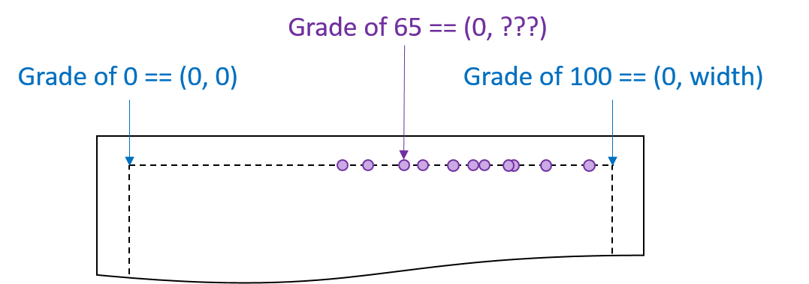

Any time that you want to visualize data in d3.js that is either a range of
continuous values or discrete categories, you want to set up a **scale**
to map the value.

## Using scales

# Motivation: Exam grades

Suppose we want to create a visualization that maps the grades for an exam as
points along a horizontal line.  Possible scores on the exam are [0, 100].
Using the [boilerplate code](boilerplate.html), our visualization
(and, thereby, the horizontal line we are drawing our points on) is `width` pixels
wide.  If we space the scores out *linearly*, we would need to calculate the
location of every point:

It is possible to use math to find out the exact location for the grade of 65,
but d3.js provides this for us.

All d3.js scales maps input values (the *domain*) to output values (the *range*)
via a function.  As a visualization designer, you need to determine what
input *domain* and output *range* is needed for the data.

In the example above,
- the input *domain* is the scores, which was [0, 100]
- the *range* is along the horizontal width of the image, which was [0, `width`]

Using a linear scale, the code to create the scale is as follows:

<pre class="prettyprint">
var gradeScale = d3.scale.linear()
                         .domain([0, 100])
                         .range([0, width]);
</pre>

The variable returned, a d3.js scale variable, can be used to [draw an axis for that scale](axes.html)
or to apply the scale to a number.  To apply the scale, use the variable as a function:

<pre class="prettyprint">
var userGrade = gradeScale(65);   // maps 65 into the range
                                  // ...if the width was 300, 65 -> 195
                                  // ...if the width was 500, 65 -> 325
</pre>

## Types of scales

# Quantitative scales

Quantitative scales are useful when your input *domain* is in the form of continuous values.
d3.js provides several different forms of quantitative scales, including:

- `d3.scale.linear()`, creating a linear scale [[d3.js documentation wiki](https://github.com/mbostock/d3/wiki/Quantitative-Scales#linear-scales)]
- `d3.scale.pow().exponent(x)`, creating a power-scale, given a power `x` [[d3.js documentation wiki](https://github.com/mbostock/d3/wiki/Quantitative-Scales#power-scales)]
    - `d3.scale.sqrt()` is a power-scale with the power `0.5`
- `d3.scale.log().base(x)`, creating a log-scale, given a base `x` [[d3.js documentation wiki](https://github.com/mbostock/d3/wiki/Quantitative-Scales#log-scales)]
   - `d3.scale.log()` creates a base-10 log-scale

Additionally, d3.js provides several other quantitative scales that are useful in more
specific cases:

- `d3.scale.threshold()`, creating a threshold scale (eg: `90` -> `A`) [[d3.js documentation wiki](https://github.com/mbostock/d3/wiki/Quantitative-Scales#threshold-scales)]
- `d3.scale.quantile()` [[d3.js documentation wiki](https://github.com/mbostock/d3/wiki/Quantitative-Scales#quantile-scales)]
- `d3.scale.quantize()` [[d3.js documentation wiki](https://github.com/mbostock/d3/wiki/Quantitative-Scales#quantize-scales)]

# Ordinal scales

Quantitative scales are useful when your input *domain* is in the form of discrete categories.
The output *range* can be defined to either be points (for scatter-plot-like visualizations)
or bands (for bar-chart-like visualizations where a value maps to a wide area).

- `d3.scale.ordinal()`, creating a ordinal scale [[d3.js documentation wiki](https://github.com/mbostock/d3/wiki/Ordinal-Scales)]
    - `.range([values])`, to specify points
    - `.rangeBands([values])`, to specify bands
