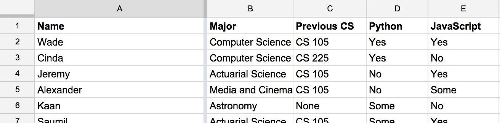

One of the most common formats that data is available in is the CSV format.
This format is both easily editable and exportable by Excel (or other spreadsheet tools)
and is also easily processed by Python (and other programming languages).

For the context of this guide, we will assume that you have set up your CSV so that
the *first row contains column headers*.  Every other row after the first contains
data.  As an example, your CSV file would look similar to the following in Excel:

# Reading a CSV file

In order to read a CSV file in Python, you will want to use the `csv` library.
To use this library, you must import it somewhere in your code:

<pre class="prettyprint">
import csv
</pre>

To read the file and process each row in the file, the following pattern can
be used:

<pre class="prettyprint">
f = open("fileName.csv")
reader = csv.DictReader(f)
for row in reader:
  # Add your own logic here
  # ...for example, printing out data in the column "Name" for each row would be:
  print(row["Name"])
</pre>

# Making multiple passes through a CSV file

One feature of `csv.DictReader` is that it **streams** the file.  This means that it
is reading one line at a time, advancing to the next, and finishes when the it reaches
the end of the file.  Because of this, you can only go through the file once per time
you `open` the file.

This feature is great for reading very large files, where you do not need all of the
file in memory at one time.  For data sets of less than a million rows, we would prefer
to be able to pass through it multiple times.

To store the data from the `reader` so that we can pass through it multiple times,
you can use the following pattern:

<pre class="prettyprint">
f = open("fileName.csv")
reader = csv.DictReader(f)
data = [row for row in reader]
</pre>

It is now possible to loop through the data multiple times:

<pre class="prettyprint">
for row in data:
  print(row["Name"])

for row in data:
  print(row["Major"])
</pre>
