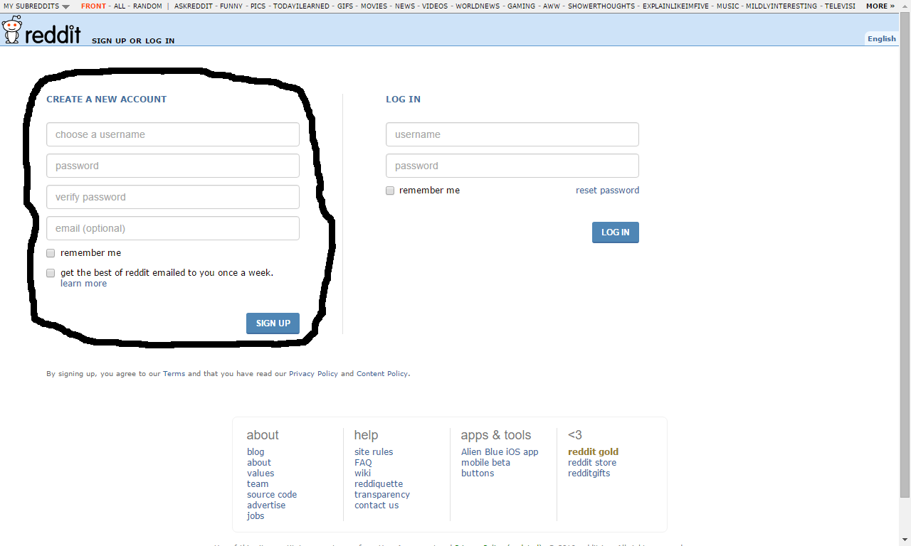
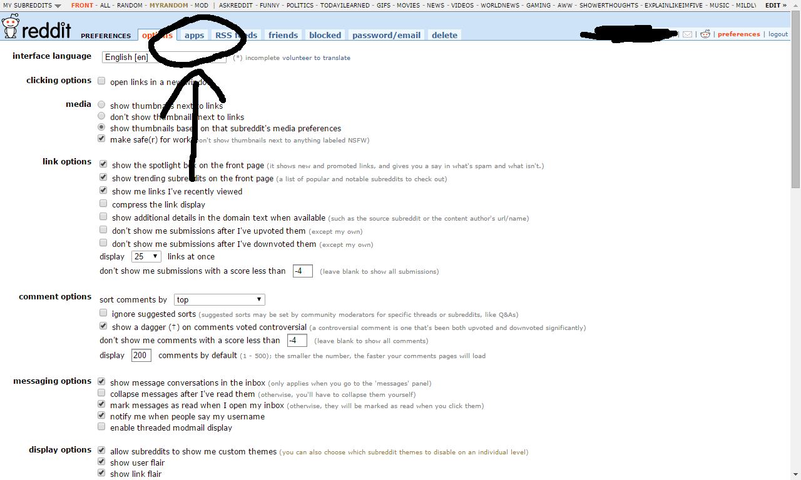
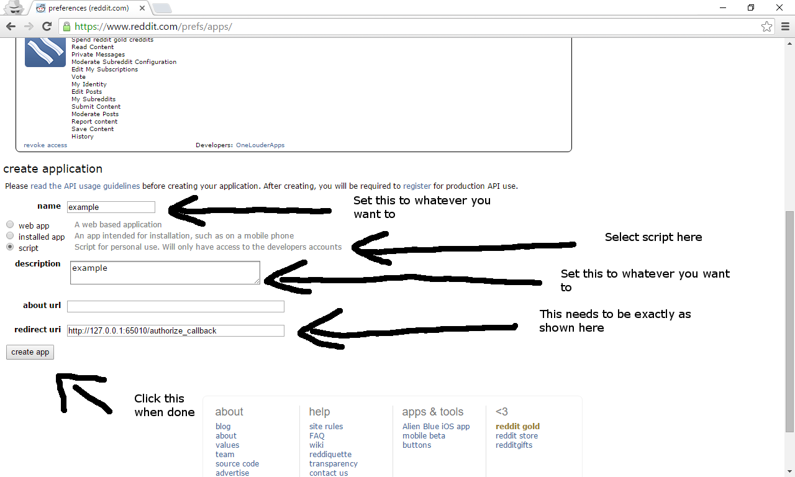
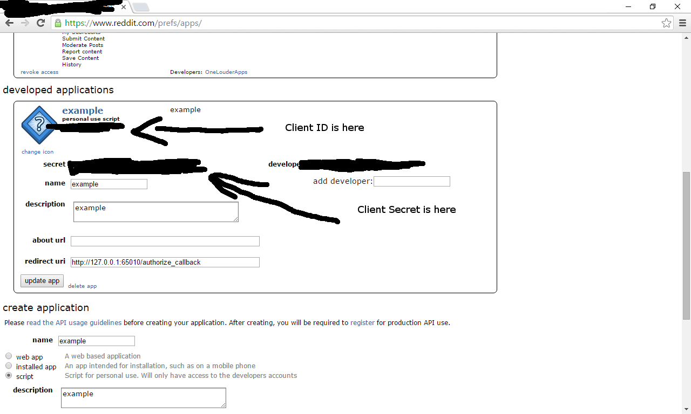

The Reddit API has an implementation in Python. This is called [PRAW](https://praw.readthedocs.org/en/stable/).
The documentation outlines how to work with the API.

# Getting Started working with the Reddit API in Python

To start, you will need a Reddit account so if you do not already have one, visit [this page](https://www.reddit.com/login)
and fill out the information under "Create a new account".



Once you have this information, log in then click "Preferences."


At the top, click the apps tab.



You should see a list of authorized applications (if you have authorized any).
Now scroll down to the bottom until you see "Developed applications" and click "Are you a developer? Create an app..."



Fill out the information in the boxes. The redirect URL needs to be entered as shown and the app type
should be "script" but everything else can be whatever you want it to be. The about URL can be blank.
Once you are done, click "Create app"


Once you have done this, you will need to obtain your client ID and client secret for the app.
To do this, find your app and if it isn't expanded already, click "edit". Then find your client
ID and client secret and put them in a safe place.



# Setting up the libraries

To continue, you will need to install a couple of libraries that will let you work with the
API in Python. These are praw and praw-OAuth2Util. We can install these using pip. If you
don't have pip installed, you can install it by opening a terminal window and running the following

'''conda install pip'''

Afterwards, you can install the packages needed by running the following

'''pip install praw praw-OAuth2Util'''

Please note that you may need to run your terminal as an administrator in order for these commands
to work.

# Setting up the config

Now that you have the libraries installed, you need to set up the config file. Open the text editor
of your choice then visit [this page](https://github.com/SmBe19/praw-OAuth2Util/blob/master/OAuth2Util/README.md).
Scroll down to "Config", then copy the sample provided there. Replace the value after app_key= with the client id for
your app and replace the value after app_secret= with your client secret. Now save this file in YOUR_WORKBOOK_DIRECTORY/static/keys/oauth.ini
where YOUR_WORKBOOK_DIRECTORY is the directory where your workbook is stored.

# Writing your first app

With the config file now set up, you can now create your first app. As an example, we will start with writing an app that will print info
about a user. To do this, create a new python file somewhere. With this file open in a text editor, enter the following code:

```python
import praw
import OAuth2Util

r = praw.Reddit("MyFirstApp") # The one argument being passed here is the user agent string
o = OAuth2Util.OAuth2Util(r, configfile="YOUR_WORKBOOK_DIRECTORY/static/keys/oauth.ini") #if you are working within the workbook directory, change configfile to ../static/keys/oauth.ini

print(r.get_me())
```

Now save this and run it with python yourfile.py. It should print information about your reddit account.

# Documentation

[PRAW](https://praw.readthedocs.org/en/stable/index.html)

[OAuth2Util](https://github.com/SmBe19/praw-OAuth2Util)

[Reddit API documentation](https://www.reddit.com/dev/api)

[Reddit API wiki on Github](https://github.com/reddit/reddit/wiki)
