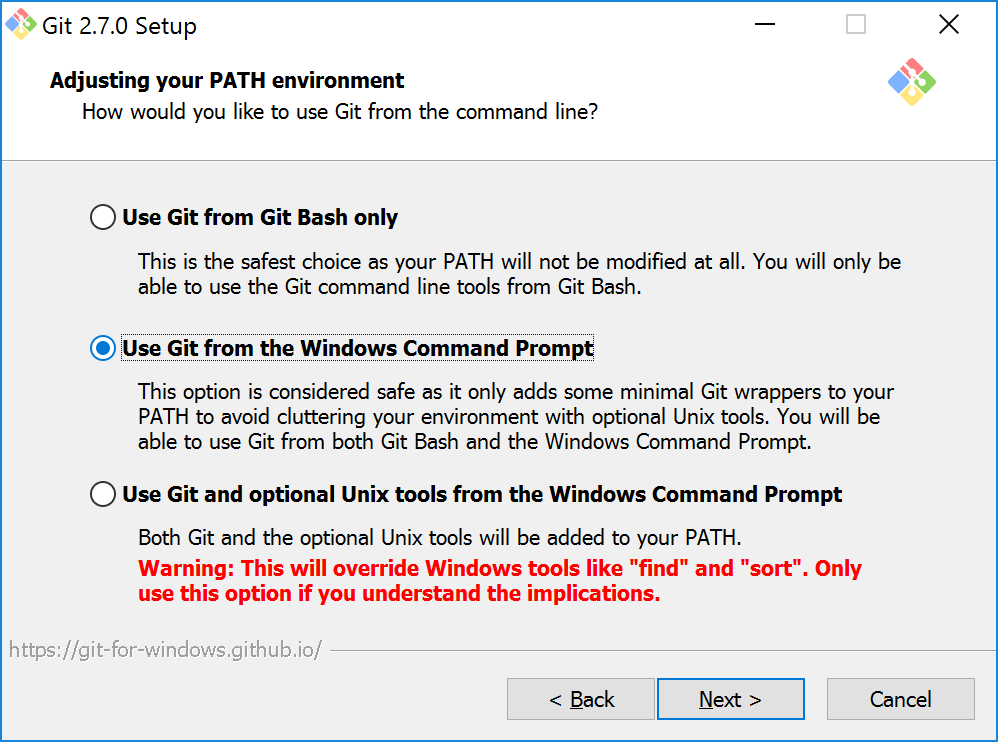

In CS 205, we will use the git source code management system to facilitate
getting source code to work on experiences and projects.  Further, git will
also be used to turn in code when you're finished.

# Installing git

git is free, open-soruce software available here:

1. Windows
    - **Importnat**: When installing on Windows, you will want to choose
      one non-default option:
        - When prompted by the installer on *Adjusting your PATH envirovement*,
          choose the second option to ensure you can use git from the Windows
          Command Prompt: 
          
    - [Download git for Windows](https://git-scm.com/download/win)

2. Mac OS X
    - [Download git for Mac OS X](http://git-scm.com/download/mac)
